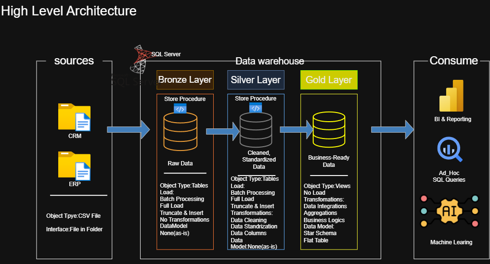
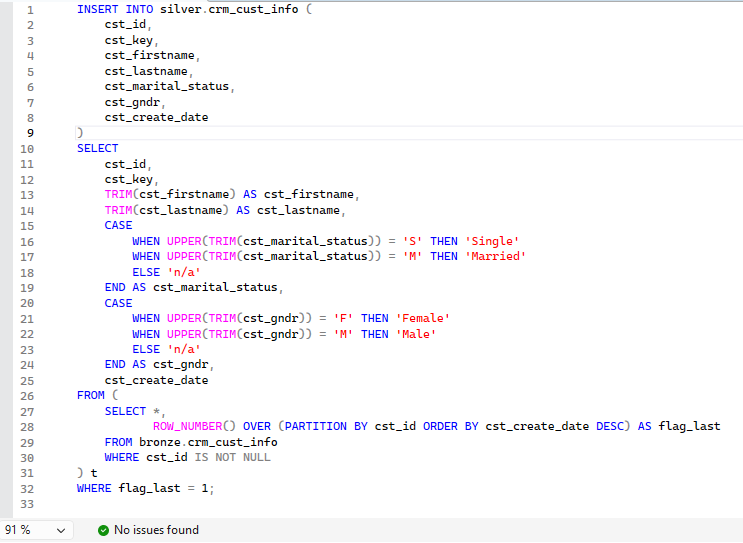
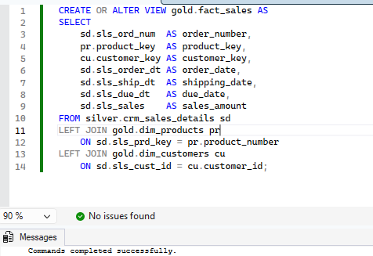

# Data Warehouse and Analytics Project
This project demonstrates how I built an end-to-end data warehouse using SQL Server, from raw data ingestion to analytical reporting. It follows the Medallion Architecture approach (Bronze, Silver, Gold) to transform raw data into business-ready insights.

---
## 🏗️ Data Architecture

The data architecture for this project follows Medallion Architecture **Bronze**, **Silver**, and **Gold** layers:


1. **Bronze Layer**: Stores raw data as-is from the source systems. Data is ingested from CSV files into SQL Server .
2. **Silver Layer**: This layer includes data cleansing, standardization, and normalization processes to prepare data for analysis.
3. **Gold Layer**: Houses business-ready data modeled into a star schema required for reporting and analytics.

---
## 📖 Project Overview
This project includes:

1. **Data Architecture**: Designed a modern data warehouse using Medallion Architecture (Bronze, Silver, Gold).
2. **ETL Pipelines**: Built SQL-based pipelines to ingest, clean, and transform data.
3. **Data Modeling**: Created fact and dimension tables using a star schema.
4. **Analytics & Reporting**: Developed SQL queries to generate business insights.


---
## 🛠️ Tools Used

- **SQL Server Express** – Data storage & processing  
- **SSMS** – Query execution & database management  
- **Power BI** – Data visualization (optional reporting)  
- **Draw.io** – Architecture & data flow diagrams  

---
## 📘 Project Documentation (Notion)

I documented the complete workflow of this project, including:
- Data Architecture Design  
- ETL Pipeline Implementation  
- Bronze, Silver, Gold Layer Development  
- Data Validation & Testing  

👉 [View full step-by-step project in Notion](https://www.notion.so/SQL-Data-Warehouse-Project-3425e7c8404880fd9502d2f997c9c1ee?source=copy_link)
---
## 🚀 Project Implementation

### 🏗️ Data Warehouse (Data Engineering)

#### What I implemented:
- Ingested raw data from ERP and CRM systems (CSV files) into SQL Server (Bronze layer)  
- Cleaned and standardized data in Silver layer (handling nulls, formatting, and inconsistencies)  
- Integrated multiple sources into a unified data model  
- Designed a star schema with fact and dimension tables in Gold layer  
- Ensured data quality through validation and transformation logic  
### 🔹 Silver Layer Transformation
Data cleaning and standardization logic applied using SQL:


### 🔹 Gold Layer (Fact Table)
Final business-ready fact table creation using joins:

---

### 📊 Analytics & Reporting (Data Analytics)

#### What I implemented:
- Built SQL queries to analyze:
  - Customer behavior  
  - Product performance  
  - Sales trends  
- Created aggregated insights such as top-performing products  
- Enabled business-ready reporting using structured Gold layer data  

### 🔹 Sample Analytical Query

```sql
SELECT 
    p.product_name,
    SUM(f.sales_amount) AS total_sales
FROM gold.fact_sales f
JOIN gold.dim_products p 
    ON f.product_key = p.product_key
GROUP BY p.product_name
ORDER BY total_sales DESC;
``` 
### 🔹 Query Output
Result of the analytical query showing top-performing products:


---
## 👩‍💻 Author

Nasrin Khatoon  
CSE Student | Aspiring Data Analyst  

Focused on:
- SQL for Data Analysis  
- Data Cleaning & Transformation  
- Data Modeling (Star Schema)  
- Analytical Querying & Insights  

